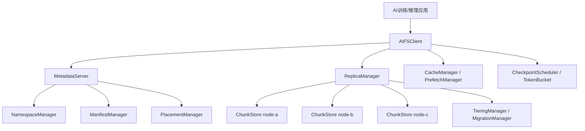

# AIFS 架构说明

AIFS 参考实现按论文方案拆成六个可替换模块。教学版代码运行在单进程内，但模块边界与分布式部署保持一致。

## 设计取舍

- 元数据路径和数据路径分离：客户端先向 Metadata Layer 获取布局，再直接读写 Storage Layer。
- Manifest 驱动预取：训练数据集的样本顺序可提前转换为读计划。
- 检查点写入独立治理：QoS Layer 对检查点写入进行排队和限速。
- 冷热分层可解释：Tiering Layer 根据访问次数和最近访问时间给出迁移建议。

